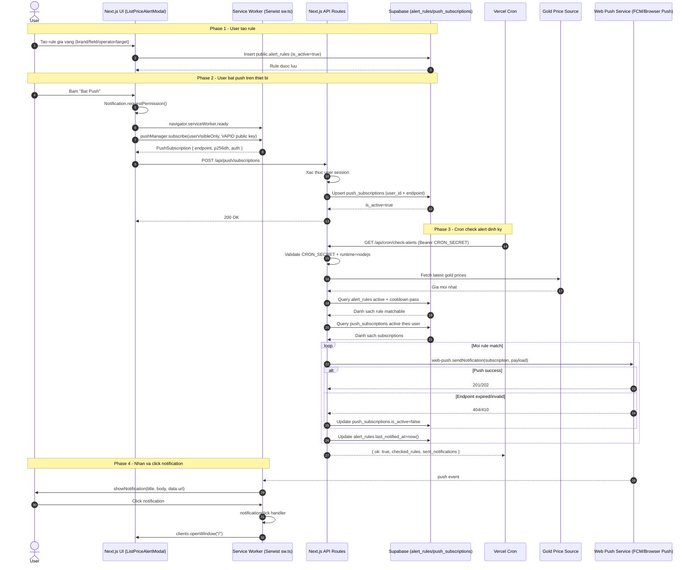

# Flow Push Notification Sequence (MVP)

## Review nhanh

- 3 endpoint toi thieu:
  - `POST /api/push/subscriptions`
  - `DELETE /api/push/subscriptions` (tuong ung unsubscribe, tuy khong ve trong diagram)
  - `GET /api/cron/check-alerts`
- Cot chong spam:
  - `alert_rules.last_notified_at` + cooldown.
- Cot on dinh:
  - Neu `web-push` tra `404/410`, deactivate subscription.
